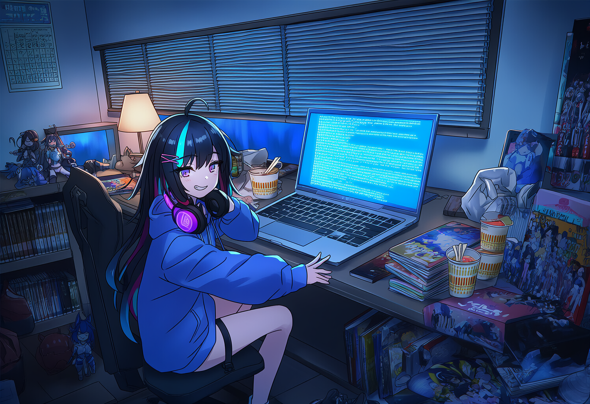

<!-- のほほん、今日も GitHub に現れた大学牲です ✧ -->

<table><tr><td>

</td><td>

### ✧ こんにちは、这里是 **houssetkrier-collab** ✧

**二次元大学生** · CS 在读 · DDL 战士 · 补番欠债人

> 「这行代码先跑通了再说——啊，新番更新了，那明天再说。」

**关于我：**
- 🎓 主修计算机，副修赶 DDL，选修睡到自然醒
- 📺 追番表常年欠更，谷子（グッズ）预算永远超支
- 💻 喜欢写零依赖的小东西——浏览器打开就能玩的那种
- 🎮 页游・音游・像素游戏都碰，菜但爱玩
- 🌸 春天想去看樱花（拍照 pose 已经想好了）

</td></tr></table>

## 🛠 技术点数

## 🎒 作品背包

| 项目 | 说明 |
| --- | --- |
| 🎏 [dual-pendulum-lab](https://github.com/houssetkrier-collab/dual-pendulum-lab) | 双摆混沌沙盒：RK4 积分 + 微扰对照，直观演示蝴蝶效应 |
| 🏃 [gravity-flip-dash](https://github.com/houssetkrier-collab/gravity-flip-dash) | 一键翻转重力的霓虹跑酷小游戏（纯前端 · 零素材） |
| 🖌 [pixelforge](https://github.com/houssetkrier-collab/pixelforge) | 浏览器本地像素画转换器：Median-Cut + 抖动，图片永不上传 |

📺 <b>本周状态栏</b>（点开有惊喜）

| 状态 | 进度 |
| --- | --- |
| 📺 番剧 | 追更 ×3，补番 ×12（欠的） |
| 💻 代码 | side project ×∞，写完 ×0 |
| 🎮 游戏 | 「就一把」× 12 把 |
| 📚 学业 | DDL 是第一生产力 |

## 📊 战绩面板

---

✧ 谢谢来访，记得吃三餐，番和代码都不会跑 ✧

